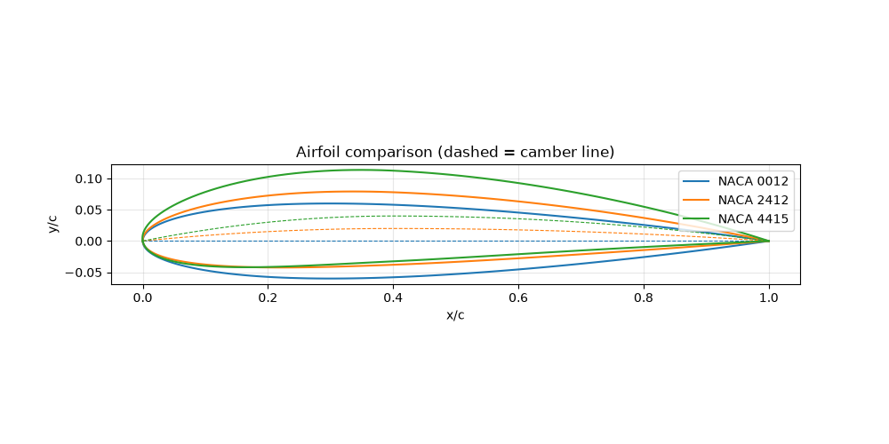

# NACA 4-Digit Airfoil Generator and Plotter

A small Python tool that computes and plots the upper and lower surface coordinates of any NACA 4-digit airfoil (e.g. NACA 2412) from the standard camber and thickness equations. It can plot a single airfoil or overlay several for comparison.



## Features

- Generates surface coordinates for any valid NACA 4-digit code
- Cosine point spacing for a smooth leading edge
- Plots a single airfoil with its camber line
- Overlays multiple airfoils on one figure for comparison
- Works from the command line or with interactive prompts

## Installation

Requires Python 3.9 or newer.

```bash
git clone https://github.com/puravpatel04/NACA-AIRFOIL-COMPARISON-PY.git
cd NACA-AIRFOIL-COMPARISON-PY
python -m venv .venv
.venv\Scripts\activate        # macOS/Linux: source .venv/bin/activate
pip install -r requirements.txt
```

## Usage

```bash
python naca4.py                    # prompts you for one or more codes
python naca4.py 2412               # plot a single airfoil
python naca4.py 0012 2412 4415     # compare several airfoils
python naca4.py 0012 4415 -n 200   # use 200 points per surface
python naca4.py -h                 # show help
```

Good comparisons to try:

| Codes | What it shows |
| --- | --- |
| `0012 2412 4412` | Effect of camber (thickness fixed at 12%) |
| `2412 2415 2421` | Effect of thickness (camber fixed) |

## How it works

### Decoding the code

For a NACA **MPXX** airfoil:

| Digits | Meaning | Example (2412) |
| --- | --- | --- |
| M | Max camber, % of chord | m = 0.02 |
| P | Location of max camber, tenths of chord | p = 0.4 |
| XX | Max thickness, % of chord | t = 0.12 |

All lengths are normalized by the chord, so $x$ runs from 0 (leading edge) to 1 (trailing edge).

### Point spacing

Points are spaced with a cosine distribution so they cluster near the leading and trailing edges, where the curvature is highest:

$$x = \frac{1}{2}\left(1 - \cos\beta\right), \quad \beta \in [0, \pi]$$

### Thickness distribution

The half-thickness at each $x$ is an empirical polynomial fit:

$$y_t = 5t\left(0.2969\sqrt{x} - 0.1260x - 0.3516x^2 + 0.2843x^3 - 0.1036x^4\right)$$

The last coefficient is $-0.1036$ (instead of the original $-0.1015$) so the trailing edge closes to a point.

### Camber line

The camber line is two parabolas that meet at $x = p$:

$$y_c = \begin{cases} \dfrac{m}{p^2}\left(2px - x^2\right) & 0 \le x < p \\[2ex] \dfrac{m}{(1-p)^2}\left((1-2p) + 2px - x^2\right) & p \le x \le 1 \end{cases}$$

with slope

$$\frac{dy_c}{dx} = \begin{cases} \dfrac{2m}{p^2}\left(p - x\right) & 0 \le x < p \\[2ex] \dfrac{2m}{(1-p)^2}\left(p - x\right) & p \le x \le 1 \end{cases}$$

For symmetric airfoils ($m = p = 0$, e.g. 0012) the camber line is simply $y_c = 0$.

### Surface coordinates

Thickness is applied perpendicular to the camber line. With $\theta = \arctan\left(dy_c/dx\right)$:

$$x_u = x - y_t \sin\theta, \qquad y_u = y_c + y_t \cos\theta$$

$$x_l = x + y_t \sin\theta, \qquad y_l = y_c - y_t \cos\theta$$

## Validation

- NACA 0012 is symmetric about the chord line
- NACA 2412 has max camber of 0.02 at $x = 0.4$
- Max thickness of NACA 2412 is about 12% of chord, near $x = 0.3$
- Results can be compared against reference coordinates, for example from [Airfoil Tools](http://airfoiltools.com)

## Project structure

```
.
├── naca4.py
├── requirements.txt
├── README.md
└── images/
    └── naca-comparison.png
```

## Possible extensions

- Export coordinates in Selig format for XFOIL or CFD meshing
- Add unit tests with `pytest`
- Support NACA 5-digit and 6-series airfoils

## References

- Abbott, I. H., and von Doenhoff, A. E., *Theory of Wing Sections*, Dover, 1959.

<<<<<<< HEAD
=======

>>>>>>> 79ae812 (Add comparison image and update README)
